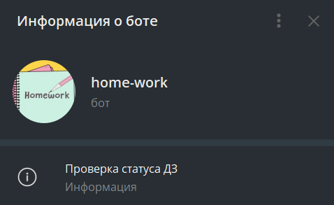

# Бот-ассистент

Бот-ассистент помогает получать актаульную информацию о статусе домашнего задания, отправленного на ревью. Бот разработан в рамках учебного проекта Яндекс.Практикума. Бот обращается к API сервиса Практикум.Домашка и узнаваёт статус домашней работы: взята ли ваша домашка в ревью, проверена ли она, а если проверена — то принял её ревьюер или вернул на доработку.

## Что умеет делать бот:

- раз в 10 минут опрашивать API сервиса Практикум.Домашка и проверять статус отправленной на ревью домашней работы;
- при обновлении статуса анализировать ответ API и отправлять вам соответствующее уведомление в Telegram;
- логировать свою работу и сообщать вам о важных проблемах сообщением в Telegram.

## Технологии:

Python, Python-Telegram-bot, Yandex Practicum API

## Запуск проекта:

Чтобы запустить проект:

1. Перейдите по указанной ниже ссылке и клонируйте проект:

https://github.com/vic-k-777/homework_bot.git

2. Установите виртуальное окружение командой:

python3 -m venv venv (если у Вас Linux)

python -m venv venv (если у Вас Windows)

3. Активируйте виртуальное окружение:

source venv/bin/activate (для Linux)

source venv/script/activate (для Windows)

4. Установите зависимости:

pip install -r requirements.txt

5. Запустите проект:

python homework.py

6. Бот проинформирует Вас о статусе домашнего задания сообщением в Telegram:

